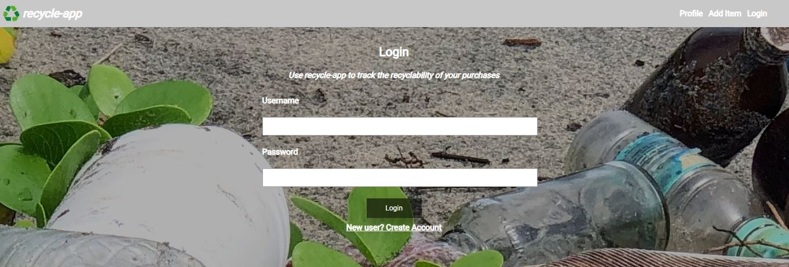
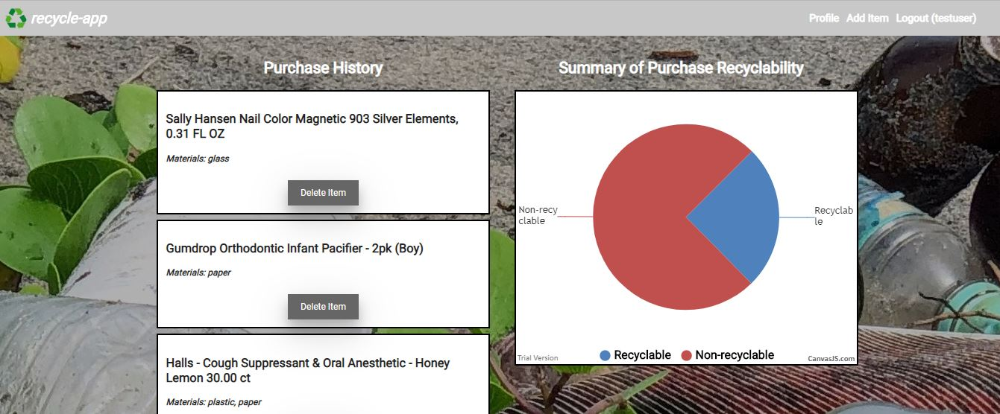
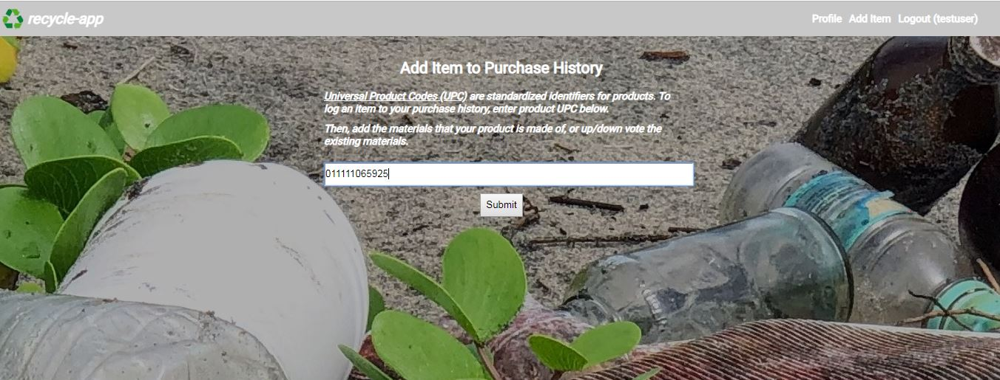
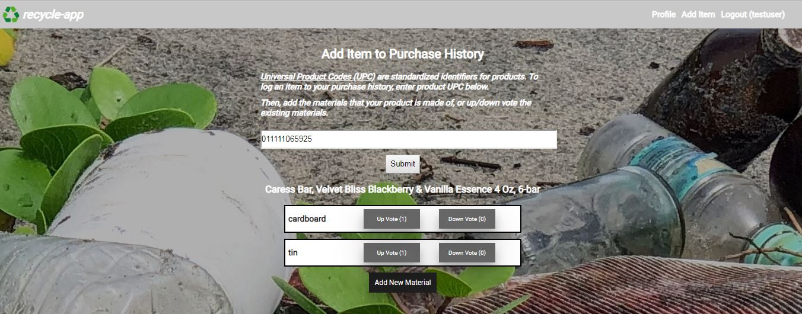

# recycle-app

https://recycle-app.herokuapp.com/

## Summary
This app enables users to track the recyclability of their purchases.

Users will log in to their profile, add items to the purchase history by UPC (barcode), and check the that materials for these items are accurate. Once the user adds all their purchases, they can view a summary of the recyclability of their purchases

## How to use the app

#### Landing Page
Log in or create account to start tracking your purchases

#### Profile
View a history of all user purchases. Delete as appropriate. View a pie chart of the percentage of recyclable items from your puchase history. For now, the recyclabilty of the materials are based on the guidance from Recology in San Francisco, CA.

#### Add Item
Add items based on UPC. 

Add the materials that are disposed off from this item OR up/down vote the current materials based on your perception of accuracy. Repeate process as needed.

## API
The app uses the following API endpoint. All HTTP requests must use Bearer Authorization with a JSON Web Token.  
API URL: https://recycle-app.herokuapp.com/api

### GET Endpoints

#### /materials
returns all materials in database

## Technology Used
The recycle-app uses jQuery, javascript, HTML, and CSS. The app was created using nodejs and API was created using Express. The data is persisted using Atlas (mongoDB).  https://api.upcitemdb.com API is used to relate UPCs to items. 

## Future Plans
In the future, new materials can be added to the database. Recycling guidance for other cities will be added 
